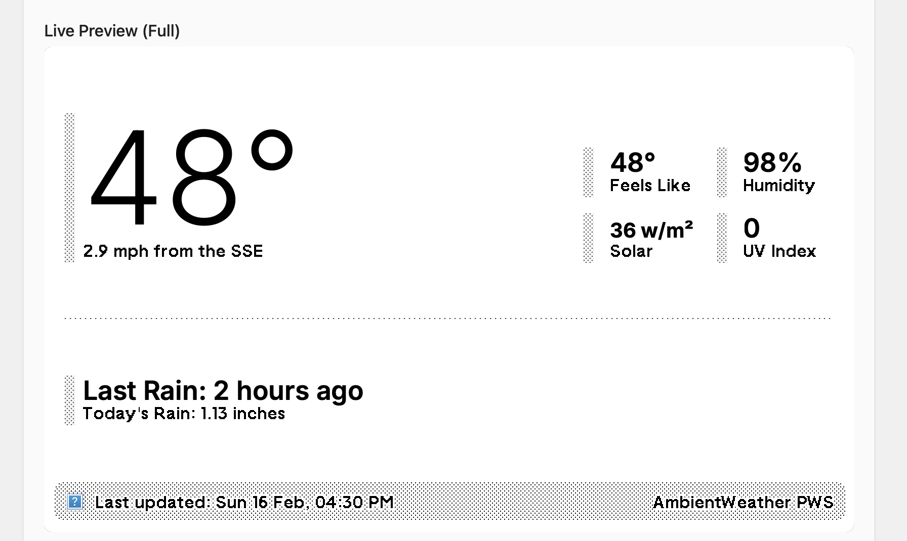

# trmnl-pws

Read data from my ambientweather.net weather station ([WS-2902](https://amzn.to/3QiAOEF)) and post it to my [TRMNL](https://usetrmnl.com) as a private plugin.

* [Ambient Weather API key](https://ambientweather.com/faqs/question/view/id/1834/?srsltid=AfmBOooaqD5PUBBUpvK-ah7IjGNQfNOULeV9MJhiIhLuBPyoZUBZDlrp)
* [TRMNL webhook instructions](https://docs.usetrmnl.com/go/plugin-marketplace/plugin-creation)
